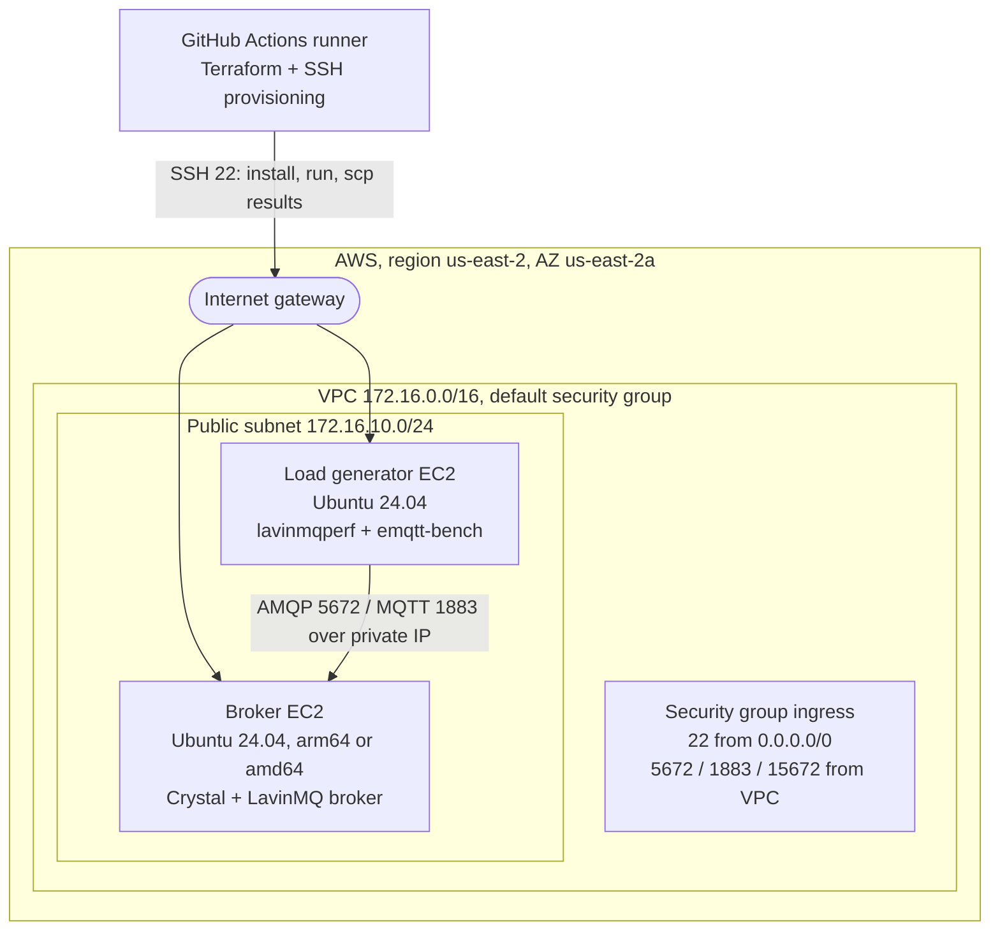
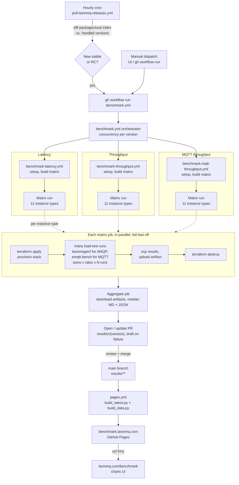

# Benchmark architecture

## Infrastructure

What `terraform apply` provisions per matrix job, and tears down when it finishes.

## Workflow

From release trigger to published results at `benchmark.lavinmq.com`.

